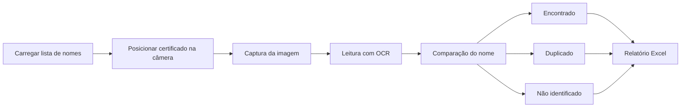

<div align="center">

# 🔎 OCR Certificados

### Scanner inteligente de certificados com Python, OCR e geração automática de relatórios em Excel


<br>


</div>

---

## ✨ Sobre o projeto

O **OCR Certificados** é uma aplicação desktop desenvolvida em Python para automatizar a conferência de certificados.

O sistema utiliza a câmera do computador para capturar o certificado, aplica OCR para reconhecer o texto, compara o nome identificado com uma lista previamente carregada e organiza os resultados automaticamente.

Ao final do processo, a aplicação gera um relatório em Excel com os participantes:

- ✅ encontrados;
- 🔁 duplicados;
- ❌ faltantes.

A proposta é reduzir o trabalho manual, aumentar a velocidade da conferência e diminuir a possibilidade de erros durante a validação de grandes volumes de certificados.

---

## 🎯 Problema resolvido

Conferir certificados manualmente pode exigir muito tempo, principalmente quando existem dezenas ou centenas de participantes.

Com esta aplicação, o fluxo passa a ser:



---

## 🚀 Funcionalidades

- Leitura de certificados pela webcam;
- reconhecimento de texto com OCR;
- carregamento de nomes por planilha Excel;
- inserção manual de nomes;
- comparação de nomes reconhecidos;
- identificação de certificados encontrados;
- detecção de registros duplicados;
- identificação de participantes faltantes;
- acompanhamento dos resultados em tempo real;
- geração automática do arquivo `resultado.xlsx`;
- interface gráfica desktop;
- funcionamento local e offline.

---

## 🧰 Tecnologias utilizadas

| Tecnologia | Finalidade |
|---|---|
| **Python** | Linguagem principal |
| **OpenCV** | Captura e processamento de imagens |
| **Tesseract OCR** | Reconhecimento de texto |
| **Pytesseract** | Integração entre Python e Tesseract |
| **Pandas** | Leitura e manipulação de dados |
| **OpenPyXL** | Criação do relatório em Excel |
| **Tkinter** | Interface gráfica da aplicação |

---

## 📁 Estrutura do projeto

```text
ocr-certificados/
├── assets/
│   └── ocr-certificados-banner.png
├── scanner.py
├── requirements.txt
├── README.md
├── LICENSE
└── .gitignore
```

---

## ⚙️ Pré-requisitos

Antes de executar o projeto, tenha instalado:

- Python 3.10 ou superior;
- Tesseract OCR;
- uma webcam funcional;
- Git, caso queira clonar o repositório.

---

## 📥 Instalação

### 1. Clone o repositório

```bash
git clone https://github.com/gabrielermogenes/ocr-certificados.git
```

### 2. Entre na pasta

```bash
cd ocr-certificados
```

### 3. Crie um ambiente virtual

No Windows:

```bash
python -m venv .venv
.venv\Scripts\activate
```

No Linux ou macOS:

```bash
python3 -m venv .venv
source .venv/bin/activate
```

### 4. Instale as dependências

```bash
pip install -r requirements.txt
```

### 5. Instale o Tesseract OCR

O Tesseract precisa estar instalado no sistema operacional.

Caso o Python não localize a instalação automaticamente, configure no arquivo `scanner.py` o caminho correspondente:

```python
pytesseract.pytesseract.tesseract_cmd = (
    r"C:\Program Files\Tesseract-OCR\tesseract.exe"
)
```

---

## ▶️ Como usar

### 1. Inicie a aplicação

```bash
python scanner.py
```

### 2. Carregue a lista de participantes

Você pode:

- clicar em **Carregar Excel** e selecionar uma planilha;
- ou clicar em **Digitar Lista** para inserir os nomes manualmente.

> Na planilha, mantenha os nomes na primeira coluna.

### 3. Inicie o scanner

Clique em **Iniciar** e posicione o certificado diante da câmera.

Para melhorar a leitura:

- deixe o certificado bem iluminado;
- evite reflexos;
- mantenha o nome visível;
- aproxime o documento sem cortar as bordas;
- mantenha a câmera estável.

### 4. Finalize o processo

Clique em **Parar** quando terminar.

A aplicação salvará o relatório em Excel automaticamente.

---

## 📊 Relatório gerado

O arquivo `resultado.xlsx` organiza o processo em categorias como:

| Categoria | Descrição |
|---|---|
| **Encontrados** | Participantes identificados corretamente |
| **Duplicados** | Certificados reconhecidos mais de uma vez |
| **Faltantes** | Nomes da lista que não foram localizados |

---

## 🔒 Privacidade e segurança

Este repositório não deve conter:

- certificados reais;
- números de documentos;
- nomes de funcionários ou participantes reais;
- planilhas internas;
- informações confidenciais de empresas;
- imagens capturadas durante o uso.

Para testes e demonstrações públicas, utilize somente dados fictícios.

---

## 🗺️ Próximas melhorias

- [ ] melhorar a precisão da comparação de nomes;
- [ ] adicionar histórico de leituras;
- [ ] criar tela de configurações;
- [ ] permitir escolha da câmera;
- [ ] gerar executável instalável;
- [ ] adicionar testes automatizados;
- [ ] melhorar o tratamento de imagens;
- [ ] criar uma versão web;
- [ ] adicionar suporte a outros modelos de certificado.

---

## 🤝 Contribuições

Contribuições são bem-vindas.

1. Faça um fork do projeto;
2. crie uma branch:

```bash
git checkout -b feature/minha-melhoria
```

3. faça suas alterações;
4. realize o commit:

```bash
git commit -m "Adiciona nova funcionalidade"
```

5. envie a branch:

```bash
git push origin feature/minha-melhoria
```

6. abra um Pull Request.

---

## 👨‍💻 Autor

Desenvolvido por **Gabriel Ermogenes**.

[](https://github.com/gabrielermogenes)
[](https://www.linkedin.com/in/devgabrielermogenes/)

---

<div align="center">

### ⭐ Caso este projeto tenha sido útil, considere deixar uma estrela no repositório.

</div>
